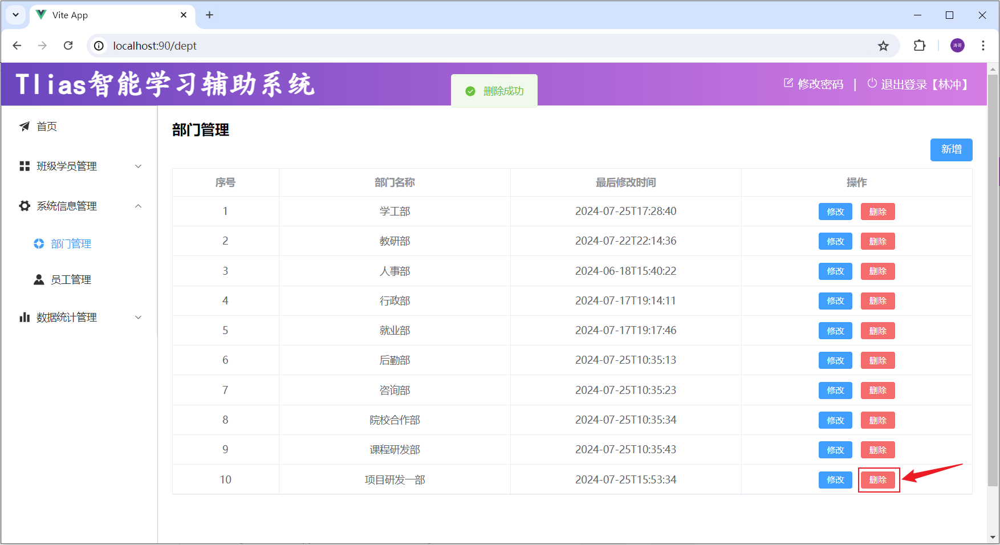

# 07\-后端Web实战\(部门管理\)

如果大家在自学的过程中，时间紧迫、没有方向、经常遇到难以解决的Bug、没有亮眼的项目、缺少AI大模型经验，而又想快速系统化的学习，高薪就业的小伙伴儿，大家都可以 [🔗](https://heuqqdmbyk.feishu.cn/wiki/Bw6lwnFxbiT4PQklfGaciQoJneg)[直接点我](https://heuqqdmbyk.feishu.cn/wiki/Bw6lwnFxbiT4PQklfGaciQoJneg) ，了解一下我们系统化的课程体系。


## 前言

前面的课程中，我们已经学习了Web开发的基础知识，包括像Maven、HTTP协议、SpringBootWeb基础、IOC、DI、MySQL、JDBC、Mybatis等。 

接下来呢，我们就要进入到后端Web实战篇的学习，在实战篇中，就要将前面学习的基础知识用起来，来完成一个大的综合案例 \- Tlias智能学习辅助系统。

那这个案例里面呢，包括以下功能：

- 部门管理


- 员工管理


- 员工信息统计


- 学员信息统计


- 班级、学员管理


**在整个实战篇中，我们需要完成如下功能：**

- 部门管理：查询、新增、修改、删除

- 员工管理：

    - 查询、新增、修改、删除

    - 文件上传

- 报表统计

- 登录认证

- 日志管理

- 班级管理（自己实战内容）

- 学员管理（自己实战内容）

那今天呢，我们就先来完成第一个模块：部门管理。


## 准备工作

### 开发规范

#### 前后端分离开发

在之前的课程中，我们介绍过，现在的企业项目开发有2种开发模式：**前后台混合开发**和**前后台分离开发**。

前后台混合开发，顾名思义就是前台后台代码混在一起开发，如下图所示：


这种开发模式有如下缺点：

- 沟通成本高：后台人员发现前端有问题，需要找前端人员修改，前端修改成功，再交给后台人员使用

- 分工不明确：后台开发人员需要开发后台代码，也需要开发部分前端代码。很难培养专业人才

- 不便管理：所有的代码都在一个工程中

- 难以维护：前端代码更新，和后台无关，但是需要整个工程包括后台一起重新打包部署。


所以我们目前基本都是采用的前**后台分离开发**方式，如下图所示：


我们将原先的工程分为前端工程和后端工程这2个工程，然后前端工程交给专业的前端人员开发，后端工程交给专业的后端人员开发。

前端页面需要数据，可以通过发送异步请求，从后台工程获取。但是，我们前后台是分开来开发的，那么前端人员怎么知道后台返回数据的格式呢？后端人员开发，怎么知道前端人员需要的数据格式呢？

所以针对这个问题，我们前后台统一制定一套规范！我们前后台开发人员都需要遵循这套规范开发，这就是我们的**接口****文档**。

接口文档有离线版和在线版本，接口文档示可以查询今天提供**资料/接口文档**里面的资料。

那么接口文档的内容怎么来的呢？是我们后台开发者根据产品经理提供的产品原型和需求文档所撰写出来的，产品原型示例可以参考今天提供**资料/页面原型**里面的资料。


那么基于前后台分离开发的模式下，我们后台开发者开发一个功能的具体流程如何呢？如下图所示：


1. 需求分析：首先我们需要阅读需求文档，分析需求，理解需求。

2. 接口定义：查询接口文档中关于需求的接口的定义，包括地址，参数，响应数据类型等等

3. 前后台并行开发：各自按照接口文档进行开发，实现需求

4. 测试：前后台开发完了，各自按照接口文档进行测试

5. 前后段联调测试：前段工程请求后端工程，测试功能


#### Restful风格

我们的案例是基于当前最为主流的前后端分离模式进行开发。


在前后端分离的开发模式中，前后端开发人员都需要根据提前定义好的接口文档，来进行前后端功能的开发。

后端开发人员：必须严格遵守提供的接口文档进行后端功能开发（保障开发的功能可以和前端对接）

而在前后端进行交互的时候，我们需要基于当前主流的REST风格的API接口进行交互。


**什么是REST风格呢?**

- REST（Representational State Transfer），表述性状态转换，它是一种软件架构风格。


**传统URL风格如下：**

- http://localhost:8080/user/getById?id=1      GET：查询id为1的用户

- http://localhost:8080/user/saveUser            POST：新增用户

- http://localhost:8080/user/updateUser         POST：修改用户

- http://localhost:8080/user/deleteUser?id=1  GET：删除id为1的用户


我们看到，原始的传统URL呢，定义比较复杂，而且将资源的访问行为对外暴露出来了。而且，对于开发人员来说，每一个开发人员都有自己的命名习惯，就拿根据id查询用户信息来说的，不同的开发人员定义的路径可能是这样的：`getById`，`selectById`，`queryById`，`loadById`\.\.\. 。 每一个人都有自己的命名习惯，如果都按照各自的习惯来，一个项目组，几十号或上百号人，那最终开发出来的项目，将会变得难以维护，没有一个统一的标准。


**基于REST风格URL如下：**

- http://localhost:8080/users/1       GET：查询id为1的用户

- http://localhost:8080/users          POST：新增用户

- http://localhost:8080/users          PUT：修改用户

- http://localhost:8080/users/1       DELETE：删除id为1的用户

其中总结起来，就一句话：通过URL定位要操作的资源，通过HTTP动词\(请求方式\)来描述具体的操作。


在REST风格的URL中，通过四种请求方式，来操作数据的增删改查。 

- GET ：  查询

- POST ：新增

- PUT ：  修改

- DELETE ：删除

我们看到如果是基于REST风格，定义URL，URL将会**更加简洁、更加规范、更加优雅**。

**注意事项：**

- REST是风格，是约定方式，约定不是规定，可以打破

- 描述模块的功能通常使用复数，也就是加s的格式来描述，表示此类资源，而非单个资源。如：users、emps、books…


#### Apifox

我们上面讲到，在这个案例中，我们将会基于Restful风格的接口进行交互，那么其中就涉及到常见的4中请求方式，包括：POST、DELETE、PUT、GET。


因为在浏览器地中所发起的所有的请求，都是GET方式的请求。那大家就需要思考两个问题：

- 前后端都在并行开发，后端开发完对应的接口之后，如何对接口进行请求测试呢？

- 前后端都在并行开发，前端开发过程中，如何获取到数据，测试页面的渲染展示呢？

那这里我们就可以借助一些接口测试工具，比如项：Postman、Apipost、Apifox等。


那这些工具的使用基本类似，只不过Apifox工具的功能更强强大、更加完善，所以在课程中，我们会采用功能更为强大的**Apifox**工具。 


##### 介绍

介绍：Apifox是一款集成了Api文档、Api调试、Api Mock、Api测试的一体化协作平台。

作用：接口文档管理、接口请求测试、Mock服务。

官网： https://apifox\.com/


##### 安装

下载Apifox的安装包（资料中已经提供），直接双击安装 。 


安装完成之后，就可以扫码登录Apifox，就可以使用啦。。。


### 工程搭建

**1\)\. ****创建SpringBoot工程，****并引入****web开发起步依赖、mybatis、mysql驱动、****lombok****。**

- 创建项目


**2\)\. ****创建数据库及对应的表结构****，并在application\.yml中配置数据库的基本信息。**

- 创建`tlias`数据库，并准备`dept`部门表。

```SQL
CREATE TABLE dept (
  id int unsigned PRIMARY KEY AUTO_INCREMENT COMMENT 'ID, 主键',
  name varchar(10) NOT NULL UNIQUE COMMENT '部门名称',
  create_time datetime DEFAULT NULL COMMENT '创建时间',
  update_time datetime DEFAULT NULL COMMENT '修改时间'
) COMMENT '部门表';

INSERT INTO dept VALUES (1,'学工部','2023-09-25 09:47:40','2024-07-25 09:47:40'),
                      (2,'教研部','2023-09-25 09:47:40','2024-08-09 15:17:04'),
                      (3,'咨询部','2023-09-25 09:47:40','2024-07-30 21:26:24'),
                      (4,'就业部','2023-09-25 09:47:40','2024-07-25 09:47:40'),
                      (5,'人事部','2023-09-25 09:47:40','2024-07-25 09:47:40'),
                      (6,'行政部','2023-11-30 20:56:37','2024-07-30 20:56:37');
```

- 在 `application.yml` 配置文件中配置数据库的连接信息。

```YAML
spring:
  application:
    name: tlias-web-management
  *#mysql连接配置*
*  *datasource:
    driver-class-name: com.mysql.cj.jdbc.Driver
    url: jdbc:mysql://localhost:3306/tlias
    username: root
    password: 1234
mybatis:
  configuration:
    log-impl: org.apache.ibatis.logging.stdout.StdOutImpl
```


**3\)\. 准备基础包结构，并引入实体类Dept及统一的响应结果封装类Result**

- 准备基础包结构


****

- 实体类Dept

```Java
package com.itheima.pojo;

import lombok.AllArgsConstructor;
import lombok.Data;
import lombok.NoArgsConstructor;

import java.time.LocalDateTime;

@Data
@NoArgsConstructor
@AllArgsConstructor
public class Dept {
    private Integer id;
    private String name;
    private LocalDateTime createTime;
    private LocalDateTime updateTime;
}
```

- 统一响应结果Result

```Java
package com.itheima.pojo;

import lombok.Data;
import java.io.Serializable;

*/***
* * 后端统一返回结果*
* */*
@Data
public class Result {

    private Integer code; //编码：1成功，0为失败
    private String msg; //错误信息
    private Object data; //数据

    public static Result success() {
        Result result = new Result();
        result.code = 1;
        result.msg = "success";
        return result;
    }

    public static Result success(Object object) {
        Result result = new Result();
        result.data = object;
        result.code = 1;
        result.msg = "success";
        return result;
    }

    public static Result error(String msg) {
        Result result = new Result();
        result.msg = msg;
        result.code = 0;
        return result;
    }

}
```


- 基础代码结构


    - DeptMapper

    ```Java
    package com.itheima.mapper;
    
    import org.apache.ibatis.annotations.Mapper;
    
    @Mapper
    public interface DeptMapper {
    }
    ```

    - DeptService

    ```Java
    package com.itheima.service;
    
    public interface DeptService {
    }
    ```

    - DeptServiceImpl

    ```Java
    package com.itheima.service.impl;
    
    import com.itheima.service.DeptService;
    import org.springframework.stereotype.Service;
    
    @Service
    public class DeptServiceImpl implements DeptService {
    }
    ```

    - DeptController

    ```Java
    package com.itheima.controller;
    
    import org.springframework.web.bind.annotation.RestController;
    
    */***
    * * 部门管理控制器*
    * */*
    @RestController
    public class DeptController {
    }
    ```


## 查询部门

### 基本实现

#### 需求

查询所有的部门数据，查询出来展示在部门管理的页面中。页面原型效果如下：


#### 接口描述

参照课程资料中提供的接口文档。 `部门管理` \-\> `部门列表查询`


#### 实现思路

明确了删除部门的需求之后，再来梳理一下实现该功能时，三层架构每一层的职责:


- Controller层，负责接收前端发起的请求，并调用service查询部门数据，然后响应结果。

- Service层，负责调用Mapper接口方法，查询所有部门数据。

- Mapper层，执行查询所有部门数据的操作。


#### 代码实现

**1\)\. Controller层**

在 `DeptController` 中，增加 `list` 方法，代码如下：

```Java
*/***
* * 部门管理控制器*
* */*
@RestController
public class DeptController {

    @Autowired
    private DeptService deptService;

    */***
*     * 查询部门列表*
*     */*
*    *@RequestMapping("/depts")
    public Result list(){
        List<Dept> deptList = deptService.findAll();
        return Result.*success*(deptList);
    }
}
```


**2\)\. Service层**

在 `DeptService` 中，增加 `findAll`方法，代码如下：

```Java
public interface DeptService {
    */***
*     * 查询所有部门*
*     */*
*    *public List<Dept> findAll();
}
```

在 `DeptServiceImpl` 中，增加 `findAll`方法，代码如下：

```Java
@Service
public class DeptServiceImpl implements DeptService {
    
    @Autowired
    private DeptMapper deptMapper;

    public List<Dept> findAll() {
        return deptMapper.findAll();
    }
}
```


**3\)\. Mapper层**

在 `DeptMapper` 中，增加 `findAll`方法，代码如下：

```Java
@Mapper
public interface DeptMapper {
    */***
*     * 查询所有部门*
*     */*
*    *@Select("select * from dept")
    public List<Dept> findAll();
    
}
```


#### 接口测试

启动项目，然后我们就可以打开Apifox进行测试了。


我们发现，已经查询出了所有的部门数据，并且响应回来的就是json格式的数据，与接口文档一致。 那接下来，我们再来测试一下，这个查询操作，我们使用post、put、delete方式来请求，是否可以获取到数据。


经过测试，我们发现，现在我们其实是可以通过任何方式的请求来访问查询部门的这个接口的。 而在接口文档中，明确要求该接口的请求方式为GET，那么如何限制请求方式呢？

- 方式一：在controller方法的@RequestMapping注解中通过method属性来限定。

```Java
@RestController
public class DeptController {

    @Autowired
    private DeptService deptService;

    */***
*     * 查询部门列表*
*     */*
*    *@RequestMapping(value = "/depts", method = RequestMethod.*GET*)
    public Result list(){
        List<Dept> deptList = deptService.findAll();
        return Result.*success*(deptList);
    }
}
```


- 方式二：在controller方法上使用，@RequestMapping的衍生注解 @GetMapping。 该注解就是标识当前方法，必须以GET方式请求。

```Java
@RestController
public class DeptController {

    @Autowired
    private DeptService deptService;

    */***
*     * 查询部门列表*
*     */*
    @GetMapping("/depts")
    public Result list(){
        List<Dept> deptList = deptService.findAll();
        return Result.*success*(deptList);
    }
}
```


上述两种方式，在项目开发中，推荐使用第二种方式，简洁、优雅。 

- GET方式：@GetMapping

- POST方式：@PostMapping

- PUT方式：@PutMapping

- DELETE方式：@DeleteMapping


#### 数据封装

在上述测试中，我们发现部门的数据中，id、name两个属性是有值的，但是createTime、updateTime两个字段值并未成功封装，而数据库中是有对应的字段值的，这是为什么呢？ 


原因如下： 

- 实体类属性名和数据库表查询返回的字段名一致，mybatis会自动封装。

- 如果实体类属性名和数据库表查询返回的字段名不一致，不能自动封装。


解决方案：

- 手动结果映射

- 起别名

- 开启驼峰命名


**1\)\. ****手动****结果映射**

在DeptMapper接口方法上，通过 @Results及@Result 进行手动结果映射。

```Java
@Results({@Result(column = "create_time", property = "createTime"),
          @Result(column = "update_time", property = "updateTime")})
@Select("select id, name, create_time, update_time from dept")
public List<Dept> findAll();
```

说明：

- `@Results` 注解源码：


- `@Result`源代码：


**2\)\. 起别名**

在SQL语句中，对不一样的列名起别名，别名和实体类属性名一样。

```Java
@Select("select id, name, create_time createTime, update_time updateTime from dept")
public List<Dept> findAll();
```


**3\)\. 开启驼峰命名****\(推荐\)**

如果字段名与属性名符合驼峰命名规则，mybatis会自动通过驼峰命名规则映射。驼峰命名规则：   abc\_xyz    =\>   abcXyz

- 表中字段名：abc\_xyz

- 类中属性名：abcXyz

在application\.yml中做如下配置，开启开关。

```YAML
mybatis:
  configuration:
    map-underscore-to-camel-case: true
```

要使用驼峰命名前提是 实体类的属性 与 数据库表中的字段名严格遵守驼峰命名。


### 前后端联调

#### 联调测试

完成了查询部门的功能，我们也通过 Apifox 工具测试通过了，下面我们再基于前后端分离的方式进行接口联调。具体操作如下：

**1\)\.**** ****将资料中提供的 "前端环境" 文件夹中的压缩包，拷贝到一个****没有中文不带空格的目录****下。**


**2\)\. 解压\(解压到当前目录\)**


**3\)\. 双击 ****`nginx.exe`**** 启动****Nginx****，一闪而过，就说明nginx已启动完成。**


如果在任务管理器中，能看到上述两个进程，就说明nginx已经启动成功。


**4\)\. 打开浏览器，访问：**[**http://localhost:90**](http://localhost:90/)


#### 请求访问流程

前端工程请求服务器的地址为 `http://localhost:90/api/depts`，是如何访问到后端的tomcat服务器的？


其实这里，是通过前端服务Nginx中提供的反向代理功能实现的。


1\)\. 浏览器发起请求，请求的是localhost:90 ，那其实请求的是nginx服务器。

2\)\. 在nginx服务器中呢，并没有对请求直接进行处理，而是将请求转发给了后端的tomcat服务器，最终由tomcat服务器来处理该请求。


这个过程就是通过nginx的反向代理实现的。 那为什么浏览器不直接请求后端的tomcat服务器，而是直接请求nginx服务器呢，主要有以下几点原因：


1\)\. 安全：由于后端的tomcat服务器一般都会搭建集群，会有很多的服务器，把所有的tomcat暴露给前端，让前端直接请求tomcat，对于后端服务器是比较危险的。

2\)\. 灵活：基于nginx的反向代理实现，更加灵活，后端想增加、减少服务器，对于前端来说是无感知的，只需要在nginx中配置即可。

3\)\. 负载均衡：基于nginx的反向代理，可以很方便的实现后端tomcat的负载均衡操作。


具体的请求访问流程如下：


> 1. location：用于定义匹配特定uri请求的规则。
> 
> 2. ^\~ /api/：表示精确匹配，即只匹配以/api/开头的路径。
> 
> 3. rewrite：该指令用于重写匹配到的uri路径。
> 
> 4. proxy\_pass：该指令用于代理转发，它将匹配到的请求转发给位于后端的指令服务器。
> 
> 


## 删除部门

### 需求

删除部门数据。在点击 "删除" 按钮，会根据ID删除部门数据。


了解了需求之后，我们再看看接口文档中，关于删除部门的接口的描述，然后根据接口文档进行服务端接口的开发。


### 接口描述

参照课程资料中提供的接口文档。 `部门管理` \-\> `删除部门`


### 思路分析

明确了删除部门的需求之后，再来梳理一下实现该功能时，三层架构每一层的职责：


### 简单参数接收

我们看到，在controller中，需要接收前端传递的请求参数。 那接下来，我们就先来看看在服务器端的Controller程序中，如何获取这类简单参数。 具体的方案有如下三种：

- **方案一：通过原始的 ****`HttpServletRequest`**** 对象获取请求参数**

```Java
/**
* 根据ID删除部门 - 简单参数接收: 方式一 (HttpServletRequest)
*/
@DeleteMapping("/depts")
public Result delete(HttpServletRequest request){
    String idStr = request.getParameter("id");
    int id = Integer.parseInt(idStr);
    
    System.out.println("根据ID删除部门: " + id);
    return Result.success();
}
```

这种方案实现较为繁琐，而且还需要进行手动类型转换。**【项目开发很少用】**


- **方案二：通过Spring提供的 ****`@RequestParam`**** ****注解****，将请求参数绑定给方法形参**

```Java
@DeleteMapping("/depts")
public Result delete(@RequestParam("id") Integer deptId){
    System.out.println("根据ID删除部门: " + deptId);
    return Result.success();
}
```

`@RequestParam` 注解的value属性，需要与前端传递的参数名保持一致 。

@RequestParam注解required属性默认为true，代表该参数必须传递，如果不传递将报错。 如果参数可选，可以将属性设置为false。


- **方案三：****如果请求参数名与形参变量名相同****，直接定义方法形参即可接收。（省略@RequestParam）**

```Java
@DeleteMapping("/depts")
public Result delete(Integer id){
    System.out.println("根据ID删除部门: " + deptId);
    return Result.success();
}
```

对于以上的这三种方案呢，我们**推荐第三种方案**。


### 代码实现

**1\)\. ****Controller层**

在 `DeptMapper`  中，增加 `delete` 方法，代码实现如下：

```Java
*/***
* * 根据id删除部门 - delete http://localhost:8080/depts?id=1*
* */*
@DeleteMapping("/depts")
public Result delete(Integer id){
    System.*out*.println("根据id删除部门, id=" + id);
    deptService.deleteById(id);
    return Result.*success*();
}
```


**2\)\. Service层**

在 `DeptService` 中，增加 `deleteById` 方法，代码实现如下：

```Java
*/***
* * 根据id删除部门*
* */*
void deleteById(Integer id);
```

在 `DeptServiceImpl` 中，增加 `deleteById` 方法，代码实现如下：

```Java
public void deleteById(Integer id) {
    deptMapper.deleteById(id);
}
```


**3\)\. Mapper层**

在 `DeptMapper` 中，增加 `deleteById` 方法，代码实现如下：

```Java
*/***
* * 根据id删除部门*
* */*
@Delete("delete from dept where id = #{id}")
void deleteById(Integer id);
```

如果mapper接口方法形参只有一个普通类型的参数，`#{…}` 里面的属性名可以随便写，如：`#{id}`、`#{value}`。

对于 DML 语句来说，执行完毕，也是有返回值的，返回值代表的是增删改操作，影响的记录数，所以可以将执行 DML 语句的方法返回值设置为 Integer。 但是一般开发时，是不需要这个返回值的，所以也可以设置为void。


代码编写完毕之后，我们就可以启动服务，进行测试了。 




## 新增部门

### 需求

点击 "新增部门" 的按钮之后，弹出新增部门表单，填写部门名称之后，点击确定之后，保存部门数据。


了解了需求之后，我们再看看接口文档中，关于新增部门的接口的描述，然后根据接口文档进行服务端接口的开发 。


### 接口描述

参照课程资料中提供的接口文档。 `部门管理` \-\> `新增部门`


### 思路分析

明确了新增部门的需求之后，再来梳理一下实现该功能时，三层架构每一层的职责：


### json参数接收

我们看到，在controller中，需要接收前端传递的请求参数。 那接下来，我们就先来看看在服务器端的Controller程序中，如何获取json格式的参数。 

- JSON格式的参数，通常会使用一个实体对象进行接收 。

- 规则：JSON数据的键名与方法形参对象的属性名相同，并需要使用`@RequestBody`注解标识。


前端传递的请求参数格式为json，内容如下：`{"name":"研发部"}`。这里，我们可以通过一个对象来接收，只需要保证对象中有name属性即可。


### 代码实现

**1\)\. Controller层**

在`DeptController`中增加方法save，具体代码如下：

```Java
*/***
* * 新增部门 - POST http://localhost:8080/depts   请求参数：{"name":"研发部"}*
* */*
@PostMapping("/depts")
public Result save(@RequestBody Dept dept){
    System.*out*.println("新增部门, dept=" + dept);
    deptService.save(dept);
    return Result.*success*();
}
```


**2\)\. Service层**

在`DeptService`中增加接口方法save，具体代码如下：

```Java
*/***
* * 新增部门*
* */*
void save(Dept dept);
```

在`DeptServiceImpl`中增加save方法，完成添加部门的操作，具体代码如下：

```Java
public void save(Dept dept) {
    //补全基础属性
    dept.setCreateTime(LocalDateTime.*now*());
    dept.setUpdateTime(LocalDateTime.*now*());
    //保存部门
    deptMapper.insert(dept);
}
```


**3\)\. Mapper层**

```Java
*/***
* * 保存部门*
* */*
@Insert("insert into dept(name,create_time,update_time) values(#{name},#{createTime},#{updateTime})")
void insert(Dept dept);
```

如果在mapper接口中，需要传递多个参数，可以把多个参数封装到一个对象中。 在SQL语句中获取参数的时候，`#{...}` 里面写的是对象的属性名【注意是属性名，不是表的字段名】。


代码编写完毕之后，我们就可以启动服务，进行测试了。 


## 修改部门

对于任何业务的修改功能来说，一般都会分为两步进行：查询回显、修改数据。


### 查询回显

#### 需求

当我们点击 "编辑" 的时候，需要根据ID查询部门数据，然后用于页面回显展示。


#### 接口描述

参照参照课程资料中提供的接口文档。 `部门管理` \-\> `根据ID查询`


#### 思路分析

明确了根据ID查询部门的需求之后，再来梳理一下实现该功能时，三层架构每一层的职责：


了解了需求之后，我们再看看接口文档中，关于根据ID查询部门的接口的描述，然后根据接口文档进行服务端接口的开发 。


#### 路径参数接收

`/depts/1`，`/depts/2` 这种在url中传递的参数，我们称之为**路径参数**。 那么如何接收这样的路径参数呢 ？

路径参数：通过请求URL直接传递参数，使用\{…\}来标识该路径参数，需要使用 **`@PathVariable`**获取路径参数。如下所示：


如果路径参数名与controller方法形参名称一致，`@PathVariable`注解的value属性是可以省略的。


#### 代码实现

**1\)\. Controller层**

在 `DeptController` 中增加 `getById`方法，具体代码如下：

```Java
*/***
* * 根据ID查询 - GET http://localhost:8080/depts/1*
* */*
@GetMapping("/depts/{id}")
public Result getById(@PathVariable Integer id){
    System.*out*.println("根据ID查询, id=" + id);
    Dept dept = deptService.getById(id);
    return Result.*success*(dept);
}
```


**2\)\. Service层**

在 `DeptService` 中增加 `getById`方法，具体代码如下：

```Java
*/***
* * 根据id查询部门*
* */*
Dept getById(Integer id);
```

在 `DeptServiceImpl` 中增加 `getById`方法，具体代码如下：

```Java
public Dept getById(Integer id) {
    return deptMapper.getById(id);
}
```


**3\)\. Mapper层**

在 `DeptMapper` 中增加 `getById` 方法，具体代码如下：

```Java
/**
* 根据ID查询部门数据
*/
@Select("select id, name, create_time, update_time from dept where id = #{id}")
Dept getById(Integer id);
```


代码编写完毕之后，我们就可以启动服务，进行测试了。 


### 修改数据

#### 需求

查询回显回来之后，就可以对部门的信息进行修改了，修改完毕之后，点击确定，此时，就需要根据ID修改部门的数据。


了解了需求之后，我们再看看接口文档中，关于修改部门的接口的描述，然后根据接口文档进行服务端接口的开发 。


#### 接口描述

参照参照课程资料中提供的接口文档。 `部门管理` \-\> `修改部门`


#### 思路分析

参照接口文档，梳理三层架构每一层的职责：


通过接口文档，我们可以看到前端传递的请求参数是json格式的请求参数，在Controller的方法中，我们可以通过 `@RequestBody` 注解来接收，并将其封装到一个对象中。


#### 代码实现

**1\)\. Controller层**

在 `DeptController` 中增加 `update` 方法，具体代码如下：

```Java
*/***
* * 修改部门 - PUT http://localhost:8080/depts  请求参数：{"id":1,"name":"研发部"}*
* */*
@PutMapping("/depts")
public Result update(@RequestBody Dept dept){
    System.*out*.println("修改部门, dept=" + dept);
    deptService.update(dept);
    return Result.*success*();
}
```


**2\)\. Service层**

在 `DeptService` 中增加 `update` 方法。

```Java
*/***
* * 修改部门*
* */*
void update(Dept dept);
```

在 `DeptServiceImpl` 中增加 `update` 方法。 由于是修改操作，每一次修改数据，都需要更新updateTime。所以，具体代码如下：

```Java
public void update(Dept dept) {
    //补全基础属性
    dept.setUpdateTime(LocalDateTime.*now*());
    //保存部门
    deptMapper.update(dept);
}
```


**3\)\. Mapper层**

在 `DeptMapper` 中增加 `update` 方法，具体代码如下：

```Java
*/***
* * 更新部门*
* */*
@Update("update dept set name = #{name},update_time = #{updateTime} where id = #{id}")
void update(Dept dept);
```


代码编写完毕之后，我们就可以启动服务，进行测试了。 


修改完成之后，我们可以看到最新的数据，如下：


#### @RequestMapping

到此呢，关于基本的部门的增删改查功能，我们已经实现了。  我们会发现，我们在 `DeptController` 中所定义的方法，所有的请求路径，都是 `/depts` 开头的，只要操作的是部门数据，请求路径都是 `/depts` 开头。 

那么这个时候，我们其实是可以把这个公共的路径 `/depts` 抽取到类上的，那在各个方法上，就可以省略了这个 `/depts` 路径。 代码如下：


一个完整的请求路径，应该是类上的 @RequestMapping 的value属性 \+ 方法上的 @RequestMapping的value属性。


## 日志技术

### 概述

- 什么是日志？

    - 日志就好比生活中的日记，可以随时随地记录你生活中的点点滴滴。

    - 程序中的日志，是用来记录应用程序的运行信息、状态信息、错误信息的。 


- 为什么要在程序中记录日志呢？

    - 便于追踪应用程序中的数据信息、程序的执行过程。

    - 便于对应用程序的性能进行优化。

    - 便于应用程序出现问题之后，排查问题，解决问题。

    - 便于监控系统的运行状态。

    - \.\.\. \.\.\.


- 之前我们编写程序时，也可以通过 `System.out.println(...) `来输出日志，为什么我们还要学习单独的日志技术呢？

这是因为，如果通过  `System.out.println(...) ` 来记录日志，会存在以下几点问题：

- 硬编码。所有的记录日志的代码，都是硬编码，没有办法做到灵活控制，要想不输出这个日志了，只能删除掉记录日志的代码。

- 只能输出日志到控制台。

- 不便于程序的扩展、维护。


所以，在现在的项目开发中，我们一般都会使用专业的日志框架，来解决这些问题。


### 日志框架


- **JUL****：**这是JavaSE平台提供的官方日志框架，也被称为JUL。配置相对简单，但不够灵活，性能较差。

- **Log4j****：**一个流行的日志框架，提供了灵活的配置选项，支持多种输出目标。

- **Logback：**基于Log4j升级而来，提供了更多的功能和配置选项，性能由于Log4j。

- **Slf4j****：**（Simple Logging Facade for Java）简单日志门面，提供了一套日志操作的标准接口及抽象类，允许应用程序使用不同的底层日志框架。


### Logback入门

**1\)\. 准备工作：****引入logback的依赖****（****springboot中无需引入****，****在springboot中已经传递了此依赖****）**

```XML
<dependency>
    <groupId>ch.qos.logback</groupId>
    <artifactId>logback-classic</artifactId>
    <version>1.4.11</version>
</dependency>
```


**2\)\. 引入配置文件 ****`logback.xml`****  （资料中已经提供，拷贝进来，放在 ****`src/main/resources`**** 目录下； 或者直接AI生成）**

```XML
<?xml version="1.0" encoding="UTF-8"?>
<configuration>
    <!-- 控制台输出 -->
    <appender name="STDOUT" class="ch.qos.logback.core.ConsoleAppender">
        <encoder class="ch.qos.logback.classic.encoder.PatternLayoutEncoder">
            <!--格式化输出：%d表示日期，%thread表示线程名，%-5level：级别从左显示5个字符宽度  %msg：日志消息，%n是换行符 -->
            <pattern>%d{yyyy-MM-dd HH:mm:ss.SSS} [%thread] %-5level %logger{50}-%msg%n</pattern>
        </encoder>
    </appender>

    <!-- 日志输出级别 -->
    <root level="ALL">
        <appender-ref ref="STDOUT" />
    </root>
</configuration>
```


**3\)\. 记录日志：定义日志记录对象Logger，记录日志**

```Java
public class LogTest {
    
    //定义日志记录对象
    private static final Logger log = LoggerFactory.getLogger(LogTest.class);

    @Test
    public void testLog(){
        log.debug("开始计算...");
        int sum = 0;
        int[] nums = {1, 5, 3, 2, 1, 4, 5, 4, 6, 7, 4, 34, 2, 23};
        for (int i = 0; i < nums.length; i++) {
            sum += nums[i];
        }
        log.info("计算结果为: "+sum);
        log.debug("结束计算...");
    }

}
```

运行单元测试，可以在控制台中看到输出的日志，如下所示：


我们可以看到在输出的日志信息中，不仅输出了日志的信息，还包括：日志的输出时间、线程名、具体在那个类中输出的。 


### Logback配置文件

Logback日志框架的配置文件叫 `logback.xml` 。 

该配置文件是对Logback日志框架输出的日志进行控制的，可以来配置输出的格式、位置及日志开关等。

常用的两种输出日志的位置：控制台、系统文件。


**1\)\. 如果需要输出日志到控制台。添加如下配置：**

```XML
<!-- 控制台输出 -->
<appender name="STDOUT" class="ch.qos.logback.core.ConsoleAppender">
    <encoder class="ch.qos.logback.classic.encoder.PatternLayoutEncoder">
            <!--格式化输出：%d 表示日期，%thread 表示线程名，%-5level表示级别从左显示5个字符宽度，%msg表示日志消息，%n表示换行符 -->
            <pattern>%d{yyyy-MM-dd HH:mm:ss.SSS} [%thread] %-5level %logger{50}-%msg%n</pattern>
    </encoder>
</appender>
```


**2\)\. 如果需要输出日志到文件。添加如下配置：**

```XML
<!-- 按照每天生成日志文件 -->
<appender name="FILE" class="ch.qos.logback.core.rolling.RollingFileAppender">
    <rollingPolicy class="ch.qos.logback.core.rolling.SizeAndTimeBasedRollingPolicy">
        <!-- 日志文件输出的文件名, %i表示序号 -->
        <FileNamePattern>D:/tlias-%d{yyyy-MM-dd}-%i.log</FileNamePattern>
        <!-- 最多保留的历史日志文件数量 -->
        <MaxHistory>30</MaxHistory>
        <!-- 最大文件大小，超过这个大小会触发滚动到新文件，默认为 10MB -->
        <maxFileSize>10MB</maxFileSize>
    </rollingPolicy>

    <encoder class="ch.qos.logback.classic.encoder.PatternLayoutEncoder">
        <!--格式化输出：%d 表示日期，%thread 表示线程名，%-5level表示级别从左显示5个字符宽度，%msg表示日志消息，%n表示换行符 -->
        <pattern>%d{yyyy-MM-dd HH:mm:ss.SSS} [%thread] %-5level %logger{50}-%msg%n</pattern>
    </encoder>
</appender>
```


**3\)\. 日志开关配置 （开启日志（****ALL****），取消日志（OFF））**

```XML
<!-- 日志输出级别 -->
<root level="ALL">
    <!--输出到控制台-->
    <appender-ref ref="STDOUT" />
    <!--输出到文件-->
    <appender-ref ref="FILE" />
</root>
```


### Logback日志级别

日志级别指的是日志信息的类型，日志都会分级别，常见的日志级别如下（优先级由低到高）：

可以在配置文件`logback.xml`中，灵活的控制输出那些类型的日志。（大于等于配置的日志级别的日志才会输出）

```XML
<!-- 日志输出级别 -->
<root level="info">
    <!--输出到控制台-->
    <appender-ref ref="STDOUT" />
    <!--输出到文件-->
    <appender-ref ref="FILE" />
</root>
```


### 案例日志记录

```Java
*/***
* * 部门管理控制器*
* */*
@Slf4j
@RequestMapping("/depts")
@RestController
public class DeptController {

    @Autowired
    private DeptService deptService;

    */***
*     * 查询部门列表*
*     */*
*    *//@RequestMapping(value = "/depts", method = RequestMethod.GET)
    @GetMapping
    public Result list(){
        //System.out.println("查询部门列表");
        *log*.info("查询部门列表");
        List<Dept> deptList = deptService.findAll();
        return Result.*success*(deptList);
    }

    */***
*     * 根据id删除部门 - delete http://localhost:8080/depts?id=1*
*     */*
*    *@DeleteMapping
    public Result delete(Integer id){
        //System.out.println("根据id删除部门, id=" + id);
        *log*.info("根据id删除部门, id: {}" , id);
        deptService.deleteById(id);
        return Result.*success*();
    }

    */***
*     * 新增部门 - POST http://localhost:8080/depts   请求参数：{"name":"研发部"}*
*     */*
*    *@PostMapping
    public Result save(@RequestBody Dept dept){
        //System.out.println("新增部门, dept=" + dept);
        *log*.info("新增部门, dept: {}" , dept);
        deptService.save(dept);
        return Result.*success*();
    }

    */***
*     * 根据ID查询 - GET http://localhost:8080/depts/1*
*     */*
*    *@GetMapping("/{id}")
    public Result getById(@PathVariable Integer id){
        //System.out.println("根据ID查询, id=" + id);
        *log*.info("根据ID查询, id: {}" , id);
        Dept dept = deptService.getById(id);
        return Result.*success*(dept);
    }

    */***
*     * 修改部门 - PUT http://localhost:8080/depts  请求参数：{"id":1,"name":"研发部"}*
*     */*
*    *@PutMapping
    public Result update(@RequestBody Dept dept){
        //System.out.println("修改部门, dept=" + dept);
        *log*.info("修改部门, dept: {}" , dept);
        deptService.update(dept);
        return Result.*success*();
    }
}
```

lombok中提供的@Slf4j注解，可以简化定义日志记录器这步操作。添加了该注解，就相当于在类中定义了日志记录器，就下面这句代码：

`private static Logger log = LoggerFactory. getLogger(Xxx. class);`


